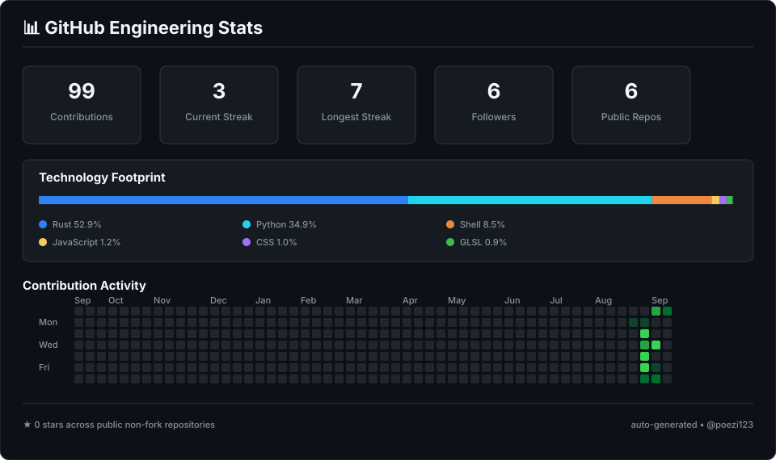

<div align="center">

# `> leon@github:~$ whoami`


<br>

[](https://github.com/poezi123)
[](https://github.com/poezi123?tab=followers)
[](https://multicipher.page.gd)

</div>

---

## 🛡️ About Me

```bash
┌──(leon㉿poezi123)-[~]
└─$ cat profile.txt

Role       : Cybersecurity Engineer / Web Developer
Education  : TU Graz
Location   : Austria 🇦🇹
Interests  : Security Research, Linux, Cryptography, Web, Open Source
Current    : Building tools, experimenting with systems, learning every day
```

I like understanding how systems work — and what happens when they don't.

My projects range from **security tooling** and **cryptography** to **Rust/Linux experiments**, low-level systems work and web development.

I enjoy building things from the ground up, breaking assumptions and learning how technology behaves below the surface.

---

## 📊 GitHub Engineering Stats

<div align="center">



</div>

> The card above is generated automatically from GitHub data by this repository's workflow.

---

## 🧰 Technology Footprint

<div align="center">


</div>

<br>

<div align="center">


</div>

---

## 🚀 Featured Projects

<table>
<tr>
<td width="50%" valign="top">

### 🔐 [CryptoSec](https://github.com/poezi123/CryptoSec)

A **Rust-based encryption tool** focused on modern cryptography, secure file handling and Linux.

`Rust` `Cryptography` `Linux`

</td>
<td width="50%" valign="top">

### 🗎 [PoeziCode](https://github.com/poezi123/poezicode)

Write documents like code and turn them into clean PDFs. Built for **Windows and Linux**.

`Windows` `Linux` `PDF`

</td>
</tr>

<tr>
<td width="50%" valign="top">

### 🔎 [NexusScan](https://github.com/poezi123/Nexusscan_public)

Security tooling written in **Python**, built for scanning, experimentation and security research.

`Python` `Security` `Scanning`

</td>
<td width="50%" valign="top">

### ⚙️ [Custom Cachy Kernel](https://github.com/poezi123/Custom-Cachy-Kernel-github)

Linux kernel experimentation, configuration and customization based around **CachyOS**.

`Shell` `Linux` `Kernel`

</td>
</tr>

<tr>
<td width="50%" valign="top">

### 👻 [Spectre Desktop Environment](https://github.com/poezi123/Spectre-Desktop-Environment)

A custom desktop environment focused on **Rust**, Linux and low-level experimentation.

`Rust` `Linux` `Desktop`

</td>
<td width="50%" valign="top">

### 🧪 More Experiments

I'm constantly working on new security, Linux and development projects.

→ [Explore all repositories](https://github.com/poezi123?tab=repositories)

`Security` `Linux` `Open Source`

</td>
</tr>
</table>

---

## 🐍 Contribution Activity

<div align="center">

<picture>
  <source
    media="(prefers-color-scheme: dark)"
    srcset="https://raw.githubusercontent.com/poezi123/poezi123/output/github-contribution-grid-snake-dark.svg"
  />
  <source
    media="(prefers-color-scheme: light)"
    srcset="https://raw.githubusercontent.com/poezi123/poezi123/output/github-contribution-grid-snake.svg"
  />
  
</picture>

</div>

---

## 🌐 Find Me

<div align="center">

[](https://github.com/poezi123)
[](https://multicipher.page.gd)

</div>

---

<div align="center">

```text
root@poezi123:~# ./build_something_cool.sh

[+] curiosity loaded
[+] security mindset enabled
[+] bugs expected
[+] learning enabled
[+] building...
```

<sub>Security • Cryptography • Development • Linux • Open Source</sub>

</div>
